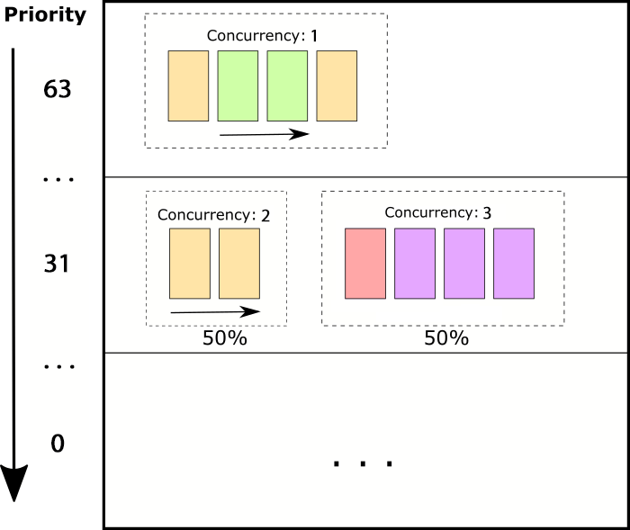
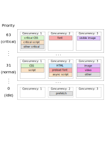

# HTTP/3 Prioritization Proposal

The HTTP/2 prioritization scheme provides a lot of flexibility but is extremely complex to implement (at least for a Browser and to deliver resources in an optimal order). The dependency tree management requires the tree state to be synchronized on both ends of the connection. Scheduling both sequential downloads (for things like render-blocking scripts and css) and concurrent downloads (for things like progressive images) and coordinating between the different resource types is complex enough that no browser has implemented a fully optimal tree. As things stand today:

**Chrome:** Builds a linear list with each request exclusively dependent on the resource before it. Resources internally are given a 1-5 priority level and they are scheduled in the order they are processed (with higher-priority items being inserted ahead of lower-priority items as necessary). This works well for the resources that benefit from sequential downloads but not for those that would benefit from concurrency.

**Firefox:** Groups resources into groups that are scheduled as a whole with groups loading sequentially after each other and resources within a group downloading concurrently. This tends to be better for images but worse for resources that would benefit from sequential loading.

**Safari:** All resources download concurrently (attached to the root) with a weight that is set based on the internal 1-5 priority.

**Edge:** No prioritization specified (may be moot with the move to Chromium).

## Design Goals
* A priority scheme that can provide the appropriate scheduling without needing the full context of other streams.
* Ordering of streams (more important delivered before lower importance).
* Specifying concurrency of download for requests to allow for both sequential and concurrent transfer of streams.
* Simple to implement for both clients and servers.

## Proposed Prioritization Scheme

The prioritization will be packed into a single byte (with no other stream ID's or data required for prioritization).

```
 0               
 0 1 2 3 4 5 6 7 
+-+-+-+-+-+-+-+-+
| Priority  | C |
+-+-+-+-+-+-+-+-+
```

In all cases, prioritization of stream delivery is based on what streams have data available to send.

Priority (6 bits, 0-63): 
* Streams at a higher priority are delivered in their entirety before streams at a lower priority.
* Streams at the same priority level are delivered as defined by their concurrency.

Concurrency (2 bits, 0-4):

0. Default (unspecified)
1. "Exclusive Sequential" : Streams with a concurrency of 1 are delivered first at a given priority level and without sharing bandwidth with any other streams. This is optimal for things like blocking scripts and CSS.
2. "Shared Sequential" : Streams with a concurrency of 2 are grouped together and delivered sequentially within the group. The group as a whole splits bandwidth evenly with the streams with concurrency 3 (50% to the one stream at a time in the concurrency 2 group and 50% to the 3-concurrency group as a whole). This is optimal for things like async or deferred scripts where you may want to load them quickly but not exclusively and where they are optimally delivered completely and in order.
3. "Shared" : Streams with a concurrency of 3 are grouped together in a single group. The allocated bandwidth for the group is split evenly across all streams in the group.

When the priority and concurrency are both set to zero, it should be assumed that prioritization is not specified and default prioritization should be applied (TBD - likely priority 0 with concurrency 3).



### Bandwidth Splitting
Bandwidth splitting is done at a frame-by-frame level where the next frame to be sent is evaluated as every frame of data is being prepared to be sent (assuming the data streams are chunked into frames on the server side for processing):

* Only consider responses where data is available to be sent.
* Select from the responses with the highest priority level.
* If "Concurrency 1" responses are available, fill the frame with the "Concurrency 1" response with the lowest stream ID.
* Otherwise, round robin between the "Concurrency 2" and "Concurrency 3" groups, picking one frame from each group.
* Within the "Concurrency 2" group, fill the frame with the response with the lowest stream ID.
* Within the "Concurrency 3" group, round robin across all of the available responses.

### Example Browser Prioritization

Based on Chromium's prioritization scheme:

